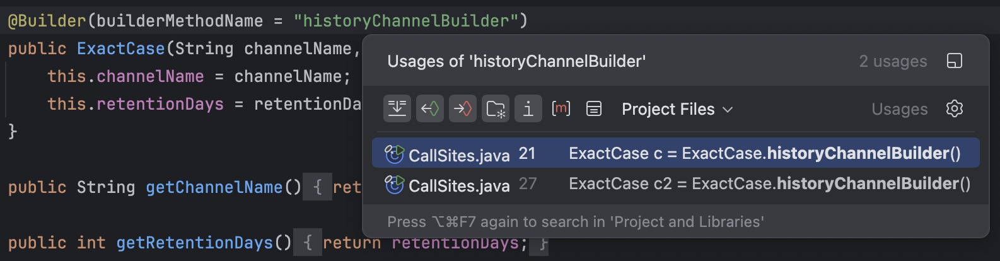
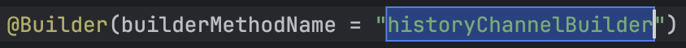

# Lombok Builder Linker

English | [한국어](README.ko.md)

[](LICENSE)

> Reconnect what Lombok `@Builder` disconnects. Navigation, Find Usages and Rename start working
> on the annotation's name strings — where they silently did nothing before.



A linker resolves the symbol references a compiler leaves dangling. This plugin does the same job
inside the editor: `@Builder(builderMethodName = "historyChannelBuilder")` names a method that
Lombok will generate, but to IntelliJ that string is just text. Ctrl+Click reports *"Cannot find
declaration to go to"*, Find Usages comes back empty, and Rename leaves the string stale while the
call sites break.

## What breaks today

Every claim below was measured across all 21 documented ways to use `@Builder` — not inferred.

| Where `@Builder` sits | Navigation, usages, rename |
|---|---|
| On a **class** | works (4/4 cases) |
| On a **constructor** or a **static / instance method** | breaks (5/5 cases) |

Placement decides everything, and the broken side is the one the
[Lombok docs recommend](https://projectlombok.org/features/Builder) once you have written a
constructor yourself.

On top of that, **all six name strings carry no reference at all** — `builderMethodName`,
`buildMethodName`, `builderClassName`, `setterPrefix`, and both `@Builder.ObtainVia` forms.

The dangerous one is `ObtainVia`. It names a method *you* wrote by hand, so the IDE sees that
method as unused: Rename leaves the string pointing at a name that no longer exists, and Safe
Delete removes the method without a warning. Nothing fails until `toBuilder()` runs.

Related JetBrains issues, all still open:
[IDEA-293203](https://youtrack.jetbrains.com/issue/IDEA-293203) ·
[IDEA-314445](https://youtrack.jetbrains.com/issue/IDEA-314445) ·
[IDEA-343275](https://youtrack.jetbrains.com/issue/IDEA-343275) ·
[IDEA-345743](https://youtrack.jetbrains.com/issue/IDEA-345743).
`@Builder` on an **instance method** is not covered by any of them.

## Features

- **The name strings become real references.** All six of them. One reference is enough for
  Ctrl+Click, Find Usages, Rename and Safe Delete to work, because all four run on the same
  machinery. In particular, a member named by `ObtainVia` is no longer silently deletable.
- **Ctrl+Click on a name string shows the IDE's own usages popup** — the call sites of the member
  that string names, with the preview and grouping you get everywhere else. The string is declared
  to the platform as what it really is: a *declaration*, not a reference.
- **Shift+F6 renames the name and every call site in one undoable step.** Editing happens in place
  in the editor, not in a dialog. When the edit ends, the annotation string and all call sites
  change together as a single command, so one Ctrl+Z brings both back — from either file. The IDE
  asks for confirmation before undoing, naming the change.
- **`setterPrefix` is renamed per setter.** The prefix is a rule, not a name: renaming `with` to
  `set` rewrites `withName` to `setName` and `withCount` to `setCount`, each keeping its own
  suffix. Its usages popup likewise collects the call sites of every setter the prefix generates.
- **Usages of a `@Builder` constructor or method come back.** The only caller is the generated
  `build()`, which has no source — so Find Usages was empty and Code Vision said *"no usages"* with
  call sites right there. The builder call sites are now reported as usages of that declaration,
  and it is no longer greyed out as unused.
- **No dependency on Lombok internals.** The plugin reads members the bundled Lombok support
  already generates, through standard PSI. It works in Community and Ultimate, and with Lombok
  support disabled it quietly does nothing.

## Installation

- **From the IDE:** Settings/Preferences → Plugins → Marketplace → search
  **Lombok Builder Linker** → Install.
- **Manually:** download the plugin ZIP, then Plugins → ⚙ → *Install Plugin from Disk…*

Requires IntelliJ IDEA **2024.3** or newer, the **Lombok plugin** (bundled with the IDE), and
`lombok` on the module classpath — the members this plugin links to are the ones Lombok's support
generates.

## Usage

Nothing to configure. Given a builder whose entry point is renamed:

```java
public class Channel {
    private final String name;

    @Builder(builderMethodName = "historyChannelBuilder")
    public Channel(String name) {
        this.name = name;
    }
}
```

- **Ctrl+Click** (⌘+Click) on `"historyChannelBuilder"` → the usages popup lists
  `Channel.historyChannelBuilder()` call sites — the screenshot above.
- **Shift+F6** (⇧F6) on the same string → the name becomes editable right there; on Enter the
  annotation and every call site change together.

  
- **Ctrl+Z** → one step brings back both, with a confirmation naming the change.
- **Alt+F7** on the string → the usages tool window, listing every call site.

With `@Builder.ObtainVia`, the method you wrote stays connected:

```java
@Builder(toBuilder = true)
public class Sample {
    private String name;

    @Builder.ObtainVia(method = "computeLength")
    private int length;

    public int computeLength() {
        return name == null ? 0 : name.length();
    }
}
```

`computeLength()` is no longer greyed out, renaming it updates the string, and Safe Delete warns
instead of removing it.

## Limitations

- **Rename starts from the annotation string, not from a call site.** On `builder()` the caret
  target is Lombok's generated method, and the Lombok plugin claims rename there itself; if this
  plugin claimed it too, IntelliJ would show a handler-chooser popup on every Shift+F6. Renaming
  from the string does update all call sites.
- **A name string with no declared value is left alone.** `builderMethodName = ""` means *do not
  generate the method* (per the Lombok docs), so there is nothing to point at. `setterPrefix`
  likewise cannot be renamed to an empty prefix — that changes the naming rule itself, not a name.
- **Names given as constants are not touched.** Only string literals are linked;
  `builderMethodName = SOME_CONSTANT` is left as is rather than guessing.
- **The IDE may navigate instead of listing.** With a single usage, or when all usages sit on one
  line — common in a builder chain — IntelliJ goes straight there instead of opening the popup.
  That is standard platform behaviour; Alt+F7 always shows the full list.
- **`@Singular`, `@SuperBuilder` and `@Builder.Default` need nothing here.** They were measured as
  already working, so the plugin stays out of their way.

## Development

```bash
./gradlew runIde       # launch a sandbox IDE with the plugin
./gradlew test         # PSI-level tests against real Lombok augmentation (no IDE window)
./gradlew buildPlugin  # build the distributable ZIP
```

Close the sandbox IDE before building: `prepareSandbox` rewrites the Lombok jar it is running from,
and Lombok's support does not survive being hot-reloaded.

## License

[MIT](LICENSE) © jeong-donghee
